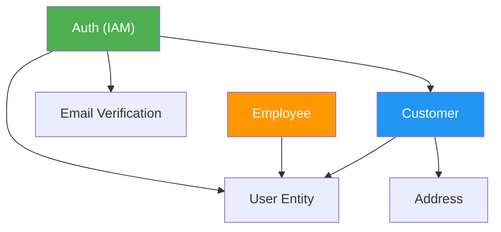
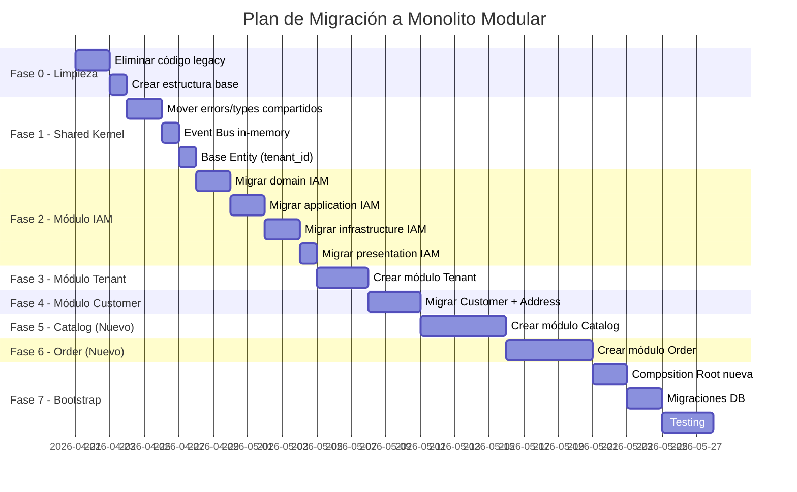

# 🏗️ Migración a Monolito Modular Multi-Tenant (SaaS)

## Guía de Migración — BurgerGo Backend

**Fecha:** Abril 2026  
**Versión:** 1.0  
**Autor:** Raul Dev  
**Stack Actual:** Node.js 22 + Express 5 + TypeScript 5.9 + PostgreSQL + TypeORM

---

## 📋 Tabla de Contenidos

1. [Resumen Ejecutivo](#1-resumen-ejecutivo)
2. [Diagnóstico del Estado Actual](#2-diagnóstico-del-estado-actual)
3. [¿Qué es un Monolito Modular?](#3-qué-es-un-monolito-modular)
4. [Estrategia Multi-Tenant para SaaS](#4-estrategia-multi-tenant-para-saas)
5. [Arquitectura Objetivo](#5-arquitectura-objetivo)
6. [Estructura de Carpetas Final](#6-estructura-de-carpetas-final)
7. [Plan de Migración por Fases](#7-plan-de-migración-por-fases)
8. [Fase 0 — Preparación y Limpieza](#8-fase-0--preparación-y-limpieza)
9. [Fase 1 — Módulo Shared Kernel](#9-fase-1--módulo-shared-kernel)
10. [Fase 2 — Módulo IAM (Identity & Access Management)](#10-fase-2--módulo-iam-identity--access-management)
11. [Fase 3 — Módulo Tenant](#11-fase-3--módulo-tenant)
12. [Fase 4 — Módulo Customer](#12-fase-4--módulo-customer)
13. [Fase 5 — Módulo Catalog (Productos/Categorías)](#13-fase-5--módulo-catalog-productoscategorías)
14. [Fase 6 — Módulo Order](#14-fase-6--módulo-order)
15. [Fase 7 — Bootstrap y Composition Root](#15-fase-7--bootstrap-y-composition-root)
16. [Comunicación entre Módulos](#16-comunicación-entre-módulos)
17. [Modelo de Datos Multi-Tenant](#17-modelo-de-datos-multi-tenant)
18. [Migración de Base de Datos](#18-migración-de-base-de-datos)
19. [Seguridad y Aislamiento de Datos](#19-seguridad-y-aislamiento-de-datos)
20. [Testing](#20-testing)
21. [Consideraciones de Despliegue](#21-consideraciones-de-despliegue)
22. [Roadmap de Módulos Futuros](#22-roadmap-de-módulos-futuros)

---

## 1. Resumen Ejecutivo

### ¿Por qué migrar?

Tu arquitectura actual de **Clean Architecture plana** funciona bien para una sola instancia (single-tenant), pero presenta limitaciones al escalar como SaaS:

| Problema Actual | Solución con Monolito Modular |
|---|---|
| Capas compartidas globalmente (domain/, application/, etc.) | Cada módulo encapsula sus propias capas |
| Sin aislamiento entre contextos de negocio | Boundaries explícitos entre módulos con contratos |
| Acoplamiento implícito entre use cases | Comunicación vía eventos o interfaces públicas |
| Sin soporte multi-tenant | `tenant_id` como filtro transversal en toda la data |
| Composition root monolítica | Cada módulo se registra independientemente |
| Difícil escalar equipo de desarrollo | Equipos pueden trabajar en módulos independientes |

### ¿Qué NO cambia?

- ✅ Express 5 como framework HTTP
- ✅ TypeORM como ORM
- ✅ PostgreSQL como base de datos
- ✅ Clean Architecture DENTRO de cada módulo
- ✅ Inyección de dependencias manual (Composition Root)
- ✅ Patrones actuales: Use Cases, Repository Pattern, DTOs

---

## 2. Diagnóstico del Estado Actual

### Arquitectura Actual (Clean Architecture Plana)

```
src/
├── domain/          ← Todas las entidades, interfaces, errores
├── application/     ← Todos los use cases, DTOs, mappers  
├── infrastructure/  ← Todos los repositorios, servicios, DB
├── presentation/    ← Todos los controllers, routes, middlewares
├── shared/          ← Logger, templates
├── modules/         ← Código legacy (auth/)
└── index.ts         ← Bootstrap + Composition Root
```

### Inventario de Funcionalidades Actuales

| Contexto | Archivos | Estado |
|---|---|---|
| **Auth** (Login, OTP, Tokens) | 5 use cases, 1 controller, 1 route | ✅ Clean Architecture |
| **Customer** (Registro, Perfil) | 6 use cases, 1 controller, 1 route | ✅ Clean Architecture |
| **Address** (CRUD Direcciones) | 5 use cases, 1 controller, 1 route | ✅ Clean Architecture |
| **Employee** (Registro) | Entidad TypeORM existente | 🟡 Solo entidad ORM |
| **Tenant** | Entidad TypeORM básica (`tenant.typorm-entity.ts`) | 🟡 Solo entidad ORM |
| **Productos/Categorías** | No implementado | ❌ Pendiente |
| **Pedidos** | No implementado | ❌ Pendiente |

### Dependencias entre Contextos Detectadas



> ⚠️ **Acoplamiento crítico detectado:** `Auth` y `Customer` comparten el `UserRepository` y los servicios de token/hashing directamente. En un monolito modular, esto se resuelve con un **Shared Kernel** o **contratos públicos**.

---

## 3. ¿Qué es un Monolito Modular?

### Definición

Un **Monolito Modular** es una arquitectura donde la aplicación se ejecuta como un solo proceso (monolito), pero internamente está organizada en **módulos autónomos** con boundaries claros.

```
┌─────────────────────────────────────────────────────────────┐
│                    BurgerGo Backend (1 proceso)              │
│                                                              │
│  ┌──────────┐  ┌──────────┐  ┌──────────┐  ┌──────────┐    │
│  │   IAM    │  │ Customer │  │ Catalog  │  │  Order   │    │
│  │ Module   │  │  Module  │  │  Module  │  │  Module  │    │
│  │          │  │          │  │          │  │          │    │
│  │ domain/  │  │ domain/  │  │ domain/  │  │ domain/  │    │
│  │ app/     │  │ app/     │  │ app/     │  │ app/     │    │
│  │ infra/   │  │ infra/   │  │ infra/   │  │ infra/   │    │
│  │ present/ │  │ present/ │  │ present/ │  │ present/ │    │
│  └──────────┘  └──────────┘  └──────────┘  └──────────┘    │
│         ↑              ↑            ↑             ↑          │
│         └──────────────┴────────────┴─────────────┘          │
│                    Shared Kernel                             │
│              (Errors, Events, Types, Logger)                 │
│                                                              │
│  ┌──────────────────────────────────────────────────────┐    │
│  │              Bootstrap / Composition Root              │   │
│  │         (DI, DB Init, Module Registration)            │   │
│  └──────────────────────────────────────────────────────┘    │
└─────────────────────────────────────────────────────────────┘
```

### Reglas del Monolito Modular

| Regla | Descripción |
|---|---|
| **1. Boundary explícito** | Cada módulo expone un `public-api.ts` (barrel export). Solo lo que está ahí es accesible |
| **2. Sin imports cruzados internos** | El módulo `Order` NO puede importar `iam/domain/entities/user.entity.ts` directamente |
| **3. Comunicación mediante contratos** | Los módulos se comunican via interfaces públicas, eventos de dominio o el Shared Kernel |
| **4. DB compartida, tablas aisladas** | Una sola base de datos, pero cada módulo "dueño" de sus tablas. No se hacen JOINs cruzados |
| **5. Clean Architecture interna** | Dentro de cada módulo se respeta Domain → Application → Infrastructure → Presentation |

### Beneficios para SaaS

- **Escalabilidad de equipo:** Cada módulo puede ser desarrollado por un equipo independiente
- **Evolución independiente:** Puedes cambiar el módulo `Catalog` sin tocar `IAM`
- **Preparado para microservicios:** Si en el futuro necesitas extraer un módulo, ya está desacoplado
- **Multi-tenant natural:** El `tenant_id` se inyecta como contexto en cada módulo

---

## 4. Estrategia Multi-Tenant para SaaS

### Opciones de Multi-Tenancy

| Estrategia | Descripción | Complejidad | Aislamiento |
|---|---|---|---|
| **DB por Tenant** | Cada tenant tiene su propia base de datos | 🔴 Alta | 🟢 Total |
| **Schema por Tenant** | Cada tenant tiene su propio schema en PostgreSQL | 🟡 Media | 🟢 Alto |
| **Fila por Tenant** (Recomendada) ✅ | Todas las tablas tienen `tenant_id` como filtro | 🟢 Baja | 🟡 Medio |

### Recomendación: Fila por Tenant con RLS (Row-Level Security)

Para tu caso (startup/MVP de SaaS), la estrategia de **fila por tenant** es la más pragmática:

```sql
-- Todas las tablas tendrán tenant_id
ALTER TABLE users ADD COLUMN tenant_id UUID NOT NULL;
ALTER TABLE customers ADD COLUMN tenant_id UUID NOT NULL;
ALTER TABLE addresses ADD COLUMN tenant_id UUID NOT NULL;
ALTER TABLE products ADD COLUMN tenant_id UUID NOT NULL;
ALTER TABLE orders ADD COLUMN tenant_id UUID NOT NULL;

-- Índices compuestos para performance
CREATE INDEX idx_users_tenant ON users(tenant_id);
CREATE INDEX idx_customers_tenant ON customers(tenant_id);
```

### Flujo de Identificación del Tenant

```
Request HTTP
    │
    ▼
┌─────────────────────┐
│  Tenant Resolver     │  ← Middleware global
│  Middleware           │
│                     │
│  1. Header:          │  X-Tenant-ID: uuid
│  2. Subdomain:       │  burger-lima.burgergo.com
│  3. Path:            │  /api/v1/tenant/:slug/...
│  4. JWT Claim:       │  { tenantId: "uuid" }
└─────────────────────┘
    │
    ▼
  TenantContext  ← Se inyecta en todos los repositorios
```

**Implementación recomendada: Subdomain + JWT Claim**

```typescript
// Ejemplo: Tenant Resolver Middleware
export const tenantResolver = async (
  req: Request, 
  _res: Response, 
  next: NextFunction
) => {
  // Opción 1: Header explícito
  const tenantId = req.headers['x-tenant-id'] as string;
  
  // Opción 2: Subdominio
  // const subdomain = req.hostname.split('.')[0];
  // const tenant = await tenantRepo.findBySlug(subdomain);
  
  // Opción 3: Del JWT (después de auth)
  // const tenantId = req.user?.tenantId;

  if (!tenantId) {
    throw new AppError('Tenant no identificado', 400);
  }
  
  // Inyectar en el request para uso posterior
  req.tenantId = tenantId;
  next();
};
```

---

## 5. Arquitectura Objetivo

### Diagrama de Arquitectura

```
┌────────────────────────────────────────────────────────────────────┐
│                         HTTP Layer (Express)                       │
│  ┌──────────────────────────────────────────────────────────────┐  │
│  │  Global Middlewares: CORS, Morgan, Tenant Resolver, Auth     │  │
│  └──────────────────────────────────────────────────────────────┘  │
│                              │                                     │
│              ┌───────────────┼────────────────┐                    │
│              ▼               ▼                ▼                    │
│  ┌───────────────┐ ┌─────────────────┐ ┌──────────────┐          │
│  │  /api/auth/*  │ │ /api/customer/* │ │ /api/catalog │          │
│  │  IAM Routes   │ │ Customer Routes │ │ Catalog Rts  │          │
│  └───────┬───────┘ └───────┬─────────┘ └──────┬───────┘          │
│          │                 │                   │                   │
├──────────┼─────────────────┼───────────────────┼───────────────────┤
│          ▼                 ▼                   ▼                   │
│  ┌───────────────┐ ┌─────────────────┐ ┌──────────────┐          │
│  │  IAM Module   │ │ Customer Module │ │Catalog Module│          │
│  │               │ │                 │ │              │          │
│  │ ┌───────────┐ │ │ ┌─────────────┐ │ │ ┌──────────┐│          │
│  │ │  Domain   │ │ │ │   Domain    │ │ │ │  Domain  ││          │
│  │ │ User      │ │ │ │ Customer    │ │ │ │ Product  ││          │
│  │ │ Role      │ │ │ │ Address     │ │ │ │ Category ││          │
│  │ │ Token     │ │ │ │             │ │ │ │          ││          │
│  │ └───────────┘ │ │ └─────────────┘ │ │ └──────────┘│          │
│  │ ┌───────────┐ │ │ ┌─────────────┐ │ │ ┌──────────┐│          │
│  │ │Application│ │ │ │ Application │ │ │ │   App    ││          │
│  │ │ Login     │ │ │ │ Register    │ │ │ │ Create   ││          │
│  │ │ Verify    │ │ │ │ Update      │ │ │ │ List     ││          │
│  │ │ OTP       │ │ │ │ GetProfile  │ │ │ │ Update   ││          │
│  │ └───────────┘ │ │ └─────────────┘ │ │ └──────────┘│          │
│  │ ┌───────────┐ │ │ ┌─────────────┐ │ │ ┌──────────┐│          │
│  │ │  Infra    │ │ │ │    Infra    │ │ │ │  Infra   ││          │
│  │ │ UserRepo  │ │ │ │ CustomerRep │ │ │ │ProductRep││          │
│  │ │ JwtSvc    │ │ │ │ AddressRepo │ │ │ │          ││          │
│  │ │ Bcrypt    │ │ │ │             │ │ │ │          ││          │
│  │ └───────────┘ │ │ └─────────────┘ │ │ └──────────┘│          │
│  └───────────────┘ └─────────────────┘ └──────────────┘          │
│                              │                                    │
│  ┌──────────────────────────────────────────────────────────────┐ │
│  │                      Shared Kernel                           │ │
│  │  AppError, Events, Logger, Types, BaseEntity, TenantContext  │ │
│  └──────────────────────────────────────────────────────────────┘ │
│                              │                                    │
│  ┌──────────────────────────────────────────────────────────────┐ │
│  │                    Infrastructure Core                       │ │
│  │         DataSource, Migrations, Tenant DB Config             │ │
│  └──────────────────────────────────────────────────────────────┘ │
└────────────────────────────────────────────────────────────────────┘
```

---

## 6. Estructura de Carpetas Final

```
BurgerGo-backend/
├── src/
│   ├── bootstrap/                          # 🟣 Arranque de la aplicación
│   │   ├── index.ts                        #   Punto de entrada principal
│   │   ├── app.ts                          #   Configuración de Express + Módulos
│   │   ├── server.ts                       #   Clase Server
│   │   └── module-registry.ts             #   Registro de módulos (DI)
│   │
│   ├── shared/                             # 🔵 Shared Kernel
│   │   ├── domain/
│   │   │   ├── errors/
│   │   │   │   ├── app-error.ts           #   Error base de la aplicación
│   │   │   │   ├── http-status-codes.ts   #   Códigos HTTP
│   │   │   │   ├── app-error-codes.ts     #   Códigos de error
│   │   │   │   └── validation.error.ts    #   Error de validación
│   │   │   ├── events/
│   │   │   │   ├── domain-event.ts        #   Interface base de evento
│   │   │   │   ├── event-bus.ts           #   Interface del bus de eventos
│   │   │   │   └── event-bus.impl.ts      #   Implementación en memoria
│   │   │   ├── interfaces/
│   │   │   │   ├── use-case.interface.ts  #   Interface base de Use Case
│   │   │   │   └── module.interface.ts    #   Interface base de Módulo
│   │   │   └── value-objects/
│   │   │       ├── email.vo.ts            #   Value Object Email
│   │   │       └── uuid.vo.ts            #   Value Object UUID
│   │   ├── infrastructure/
│   │   │   ├── database/
│   │   │   │   ├── data-source.ts         #   Configuración TypeORM
│   │   │   │   ├── base.typeorm-entity.ts #   Entidad base con tenant_id
│   │   │   │   └── migrations/           #   Migraciones globales
│   │   │   ├── middleware/
│   │   │   │   ├── tenant-resolver.middleware.ts
│   │   │   │   ├── error-handler.middleware.ts
│   │   │   │   ├── validation-dto.middleware.ts
│   │   │   │   └── catch-error.middleware.ts
│   │   │   └── services/
│   │   │       └── logger.ts              #   Logger (Pino)
│   │   └── types/
│   │       ├── express.d.ts               #   Extensión de Request (tenantId, userId)
│   │       └── module-config.ts           #   Tipos compartidos de configuración
│   │
│   ├── modules/                            # 🟢 Módulos de Negocio
│   │   │
│   │   ├── iam/                            #   Identity & Access Management
│   │   │   ├── domain/
│   │   │   │   ├── entities/
│   │   │   │   │   ├── user.entity.ts
│   │   │   │   │   ├── role.entity.ts
│   │   │   │   │   └── email-verification.entity.ts
│   │   │   │   ├── repository/
│   │   │   │   │   ├── user.repository.interface.ts
│   │   │   │   │   ├── role.repository.interface.ts
│   │   │   │   │   ├── email-verification.repository.interface.ts
│   │   │   │   │   └── unit-of-work.interface.ts
│   │   │   │   ├── interfaces/
│   │   │   │   │   ├── password-hasher.interface.ts
│   │   │   │   │   ├── token.interface.ts
│   │   │   │   │   └── email.interface.ts
│   │   │   │   └── events/
│   │   │   │       ├── user-registered.event.ts
│   │   │   │       └── user-verified.event.ts
│   │   │   ├── application/
│   │   │   │   ├── use-cases/
│   │   │   │   │   ├── login.use-case.ts
│   │   │   │   │   ├── register-user.use-case.ts
│   │   │   │   │   ├── verify-email.use-case.ts
│   │   │   │   │   ├── resend-code.use-case.ts
│   │   │   │   │   ├── verify-token.use-case.ts
│   │   │   │   │   └── change-password.use-case.ts
│   │   │   │   └── dtos/
│   │   │   │       ├── login-request.dto.ts
│   │   │   │       ├── register-request.dto.ts
│   │   │   │       ├── login-response.dto.ts
│   │   │   │       └── verify-email.dto.ts
│   │   │   ├── infrastructure/
│   │   │   │   ├── persistence/
│   │   │   │   │   ├── typeorm-entities/
│   │   │   │   │   │   ├── user.typeorm-entity.ts
│   │   │   │   │   │   ├── role.typeorm-entity.ts
│   │   │   │   │   │   └── email-verification.typeorm-entity.ts
│   │   │   │   │   ├── repositories/
│   │   │   │   │   │   ├── user.repository.ts
│   │   │   │   │   │   ├── role.repository.ts
│   │   │   │   │   │   └── email-verification.repository.ts
│   │   │   │   │   └── unit-of-work.typeorm.ts
│   │   │   │   └── services/
│   │   │   │       ├── bcrypt-password-hasher.service.ts
│   │   │   │       ├── jwt-token.service.ts
│   │   │   │       └── nodemailer-email.service.ts
│   │   │   ├── presentation/
│   │   │   │   ├── controllers/
│   │   │   │   │   └── auth.controller.ts
│   │   │   │   ├── routes/
│   │   │   │   │   └── auth.routes.ts
│   │   │   │   └── middlewares/
│   │   │   │       ├── auth-token.middleware.ts
│   │   │   │       └── verification-session.middleware.ts
│   │   │   ├── iam.module.ts               #   Registro del módulo (composition)
│   │   │   └── public-api.ts               #   🔑 Barrel export público
│   │   │
│   │   ├── tenant/                         #   Gestión de Tenants
│   │   │   ├── domain/
│   │   │   │   ├── entities/
│   │   │   │   │   └── tenant.entity.ts
│   │   │   │   └── repository/
│   │   │   │       └── tenant.repository.interface.ts
│   │   │   ├── application/
│   │   │   │   ├── use-cases/
│   │   │   │   │   ├── create-tenant.use-case.ts
│   │   │   │   │   ├── get-tenant.use-case.ts
│   │   │   │   │   └── update-tenant.use-case.ts
│   │   │   │   └── dtos/
│   │   │   │       └── create-tenant.dto.ts
│   │   │   ├── infrastructure/
│   │   │   │   └── persistence/
│   │   │   │       ├── typeorm-entities/
│   │   │   │       │   └── tenant.typeorm-entity.ts
│   │   │   │       └── repositories/
│   │   │   │           └── tenant.repository.ts
│   │   │   ├── presentation/
│   │   │   │   ├── controllers/
│   │   │   │   │   └── tenant.controller.ts
│   │   │   │   └── routes/
│   │   │   │       └── tenant.routes.ts
│   │   │   ├── tenant.module.ts
│   │   │   └── public-api.ts
│   │   │
│   │   ├── customer/                       #   Gestión de Clientes
│   │   │   ├── domain/
│   │   │   │   ├── entities/
│   │   │   │   │   ├── customer.entity.ts
│   │   │   │   │   └── address.entity.ts
│   │   │   │   └── repository/
│   │   │   │       ├── customer.repository.interface.ts
│   │   │   │       └── address.repository.interface.ts
│   │   │   ├── application/
│   │   │   │   ├── use-cases/
│   │   │   │   │   ├── register-customer.use-case.ts
│   │   │   │   │   ├── update-customer.use-case.ts
│   │   │   │   │   ├── get-profile.use-case.ts
│   │   │   │   │   ├── create-address.use-case.ts
│   │   │   │   │   ├── update-address.use-case.ts
│   │   │   │   │   ├── delete-address.use-case.ts
│   │   │   │   │   ├── list-addresses.use-case.ts
│   │   │   │   │   └── set-default-address.use-case.ts
│   │   │   │   └── dtos/
│   │   │   │       ├── create-customer.dto.ts
│   │   │   │       ├── update-customer.dto.ts
│   │   │   │       ├── create-address.dto.ts
│   │   │   │       └── update-address.dto.ts
│   │   │   ├── infrastructure/
│   │   │   │   └── persistence/
│   │   │   │       ├── typeorm-entities/
│   │   │   │       │   ├── customer.typeorm-entity.ts
│   │   │   │       │   └── address.typeorm-entity.ts
│   │   │   │       └── repositories/
│   │   │   │           ├── customer.repository.ts
│   │   │   │           └── address.repository.ts
│   │   │   ├── presentation/
│   │   │   │   ├── controllers/
│   │   │   │   │   ├── customer.controller.ts
│   │   │   │   │   └── address.controller.ts
│   │   │   │   └── routes/
│   │   │   │       ├── customer.routes.ts
│   │   │   │       └── address.routes.ts
│   │   │   ├── customer.module.ts
│   │   │   └── public-api.ts
│   │   │
│   │   ├── catalog/                        #   Productos y Categorías (NUEVO)
│   │   │   ├── domain/
│   │   │   ├── application/
│   │   │   ├── infrastructure/
│   │   │   ├── presentation/
│   │   │   ├── catalog.module.ts
│   │   │   └── public-api.ts
│   │   │
│   │   └── order/                          #   Pedidos (NUEVO)
│   │       ├── domain/
│   │       ├── application/
│   │       ├── infrastructure/
│   │       ├── presentation/
│   │       ├── order.module.ts
│   │       └── public-api.ts
│   │
│   └── config/                             # Configuración global
│       ├── env.config.ts                   #   Variables de entorno validadas
│       ├── cors.config.ts
│       └── jwt.config.ts
│
├── docs/
├── tests/
│   ├── unit/
│   │   ├── iam/
│   │   ├── customer/
│   │   └── shared/
│   ├── integration/
│   └── e2e/
├── docker-compose.yaml
├── package.json
└── tsconfig.json
```

---

## 7. Plan de Migración por Fases

### Visión General de Fases



> **Tiempo estimado:** 4-6 semanas (desarrollo part-time)

---

## 8. Fase 0 — Preparación y Limpieza

### 8.1 Eliminar Código Legacy

Los siguientes archivos/carpetas son legacy y deben eliminarse:

```
❌ src/modules/auth/          → Ya migrado a presentation/http/ + application/use-cases/auth/
❌ src/entities/              → Ya reemplazado por infrastructure/database/typeorm/entities/
❌ src/errors/                → Ya reemplazado por domain/errors/
❌ src/interfaces/            → Ya reemplazado por domain/interfaces/
❌ src/utils/                 → Parcialmente reemplazado por shared/logger.ts
❌ src/constants/             → Ya reemplazado por domain/errors/
```

### 8.2 Crear Estructura Base de Directorios

```bash
# Desde la raíz del proyecto
mkdir -p src/bootstrap
mkdir -p src/shared/domain/errors
mkdir -p src/shared/domain/events
mkdir -p src/shared/domain/interfaces
mkdir -p src/shared/domain/value-objects
mkdir -p src/shared/infrastructure/database
mkdir -p src/shared/infrastructure/middleware
mkdir -p src/shared/infrastructure/services
mkdir -p src/shared/types
mkdir -p src/modules/iam
mkdir -p src/modules/tenant
mkdir -p src/modules/customer
mkdir -p src/modules/catalog
mkdir -p src/modules/order
mkdir -p src/config
```

### 8.3 Configurar Path Aliases en tsconfig.json

```jsonc
{
  "compilerOptions": {
    // ... opciones existentes
    "baseUrl": "./src",
    "paths": {
      "@shared/*": ["shared/*"],
      "@modules/*": ["modules/*"],
      "@config/*": ["config/*"],
      "@bootstrap/*": ["bootstrap/*"],
      // Aliases por módulo
      "@iam/*": ["modules/iam/*"],
      "@customer/*": ["modules/customer/*"],
      "@tenant/*": ["modules/tenant/*"],
      "@catalog/*": ["modules/catalog/*"],
      "@order/*": ["modules/order/*"]
    }
  }
}
```

> **Instalar dependencia para resolver paths en runtime:**
> ```bash
> npm install tsconfig-paths
> npm install -D tsc-alias
> ```
>
> Actualizar `package.json`:
> ```json
> {
>   "scripts": {
>     "dev": "nodemon --exec ts-node -r tsconfig-paths/register src/bootstrap/index.ts",
>     "build": "tsc && tsc-alias",
>     "start": "node ./dist/bootstrap/index.js"
>   }
> }
> ```

---

## 9. Fase 1 — Módulo Shared Kernel

### 9.1 Interface Base de Módulo

```typescript
// src/shared/domain/interfaces/module.interface.ts
import { Router } from 'express';
import { DataSource } from 'typeorm';

export interface IModule {
  /** Nombre único del módulo */
  readonly name: string;
  
  /** Registrar rutas del módulo */
  registerRoutes(globalMiddlewares: Record<string, any>): Router;
  
  /** Inicializar dependencias (Composition Root del módulo) */
  initialize(dataSource: DataSource): void;
}
```

### 9.2 Entidad Base con Tenant ID

```typescript
// src/shared/infrastructure/database/base.typeorm-entity.ts
import {
  PrimaryGeneratedColumn,
  Column,
  CreateDateColumn,
  UpdateDateColumn,
} from 'typeorm';

export abstract class BaseTenantEntity {
  @PrimaryGeneratedColumn('uuid')
  id: string;

  @Column({ type: 'uuid', name: 'tenant_id' })
  tenantId: string;

  @CreateDateColumn({ name: 'created_at' })
  createdAt: Date;

  @UpdateDateColumn({ name: 'updated_at' })
  updatedAt: Date;
}
```

### 9.3 Event Bus (Comunicación entre módulos)

```typescript
// src/shared/domain/events/domain-event.ts
export interface DomainEvent {
  readonly eventName: string;
  readonly occurredOn: Date;
  readonly payload: Record<string, any>;
}

// src/shared/domain/events/event-bus.ts
export interface IEventBus {
  publish(event: DomainEvent): Promise<void>;
  subscribe(eventName: string, handler: (event: DomainEvent) => Promise<void>): void;
}

// src/shared/domain/events/event-bus.impl.ts
export class InMemoryEventBus implements IEventBus {
  private handlers = new Map<string, Array<(event: DomainEvent) => Promise<void>>>();

  async publish(event: DomainEvent): Promise<void> {
    const subscribers = this.handlers.get(event.eventName) || [];
    await Promise.all(subscribers.map(handler => handler(event)));
  }

  subscribe(eventName: string, handler: (event: DomainEvent) => Promise<void>): void {
    const existing = this.handlers.get(eventName) || [];
    existing.push(handler);
    this.handlers.set(eventName, existing);
  }
}
```

### 9.4 Tenant Context (AsyncLocalStorage)

```typescript
// src/shared/infrastructure/middleware/tenant-context.ts
import { AsyncLocalStorage } from 'node:async_hooks';

export interface TenantInfo {
  tenantId: string;
  tenantSlug?: string;
}

export const tenantStorage = new AsyncLocalStorage<TenantInfo>();

/** Obtener el tenant actual desde cualquier parte del código */
export const getCurrentTenant = (): TenantInfo => {
  const tenant = tenantStorage.getStore();
  if (!tenant) {
    throw new Error('No hay tenant en el contexto actual');
  }
  return tenant;
};

/** Obtener solo el tenantId */
export const getCurrentTenantId = (): string => {
  return getCurrentTenant().tenantId;
};
```

### 9.5 Tenant Resolver Middleware

```typescript
// src/shared/infrastructure/middleware/tenant-resolver.middleware.ts
import { Request, Response, NextFunction } from 'express';
import { tenantStorage, TenantInfo } from './tenant-context';
import { AppError } from '@shared/domain/errors/app-error';
import { BAD_REQUEST } from '@shared/domain/errors/http-status-codes';

export const tenantResolverMiddleware = (
  req: Request,
  _res: Response,
  next: NextFunction
) => {
  // Rutas públicas que no necesitan tenant (e.g., health check, registro de tenant)
  const publicPaths = ['/api/health', '/api/tenants/register'];
  if (publicPaths.some(path => req.path.startsWith(path))) {
    return next();
  }

  const tenantId = req.headers['x-tenant-id'] as string;

  if (!tenantId) {
    throw new AppError('Header X-Tenant-ID es requerido', BAD_REQUEST);
  }

  // Ejecutar el resto del request dentro del contexto del tenant
  const tenantInfo: TenantInfo = { tenantId };
  
  tenantStorage.run(tenantInfo, () => {
    next();
  });
};
```

### 9.6 Extensión de Express Request

```typescript
// src/shared/types/express.d.ts
declare global {
  namespace Express {
    interface Request {
      tenantId?: string;
      userId?: string;
      userEmail?: string;
      userRole?: string;
    }
  }
}
export {};
```

### 9.7 Mover Errores al Shared Kernel

Los archivos actuales en `src/domain/errors/` se mueven a `src/shared/domain/errors/` sin cambios significativos:

| Archivo Actual | Destino |
|---|---|
| `domain/errors/app-error.error.ts` | `shared/domain/errors/app-error.ts` |
| `domain/errors/http-status-code.ts` | `shared/domain/errors/http-status-codes.ts` |
| `domain/errors/app-error-code.ts` | `shared/domain/errors/app-error-codes.ts` |
| `domain/errors/validation.error.ts` | `shared/domain/errors/validation.error.ts` |

---

## 10. Fase 2 — Módulo IAM (Identity & Access Management)

### 10.1 Mapeo de Archivos (Origen → Destino)

#### Domain Layer

| Archivo Actual | Destino en Módulo IAM |
|---|---|
| `domain/entities/user.entity.ts` | `modules/iam/domain/entities/user.entity.ts` |
| `domain/entities/rol.entity.ts` | `modules/iam/domain/entities/role.entity.ts` |
| `domain/entities/email-verification.entity.ts` | `modules/iam/domain/entities/email-verification.entity.ts` |
| `domain/repository/user.repository.interface.ts` | `modules/iam/domain/repository/user.repository.interface.ts` |
| `domain/repository/rol.repository.interface.ts` | `modules/iam/domain/repository/role.repository.interface.ts` |
| `domain/repository/email-verification.repository.interface.ts` | `modules/iam/domain/repository/email-verification.repository.interface.ts` |
| `domain/repository/unit-of-work.interface.ts` | `modules/iam/domain/repository/unit-of-work.interface.ts` |
| `domain/interfaces/password-hasher.interface.ts` | `modules/iam/domain/interfaces/password-hasher.interface.ts` |
| `domain/interfaces/token.interface.ts` | `modules/iam/domain/interfaces/token.interface.ts` |
| `domain/interfaces/email.interface.ts` | `modules/iam/domain/interfaces/email.interface.ts` |

#### Application Layer

| Archivo Actual | Destino en Módulo IAM |
|---|---|
| `application/use-cases/auth/login.user-case.ts` | `modules/iam/application/use-cases/login.use-case.ts` |
| `application/use-cases/auth/verify-email-account.use-case.ts` | `modules/iam/application/use-cases/verify-email.use-case.ts` |
| `application/use-cases/auth/resend-code.use-case.ts` | `modules/iam/application/use-cases/resend-code.use-case.ts` |
| `application/use-cases/auth/verify-token.use-case.ts` | `modules/iam/application/use-cases/verify-token.use-case.ts` |
| `application/use-cases/auth/profile.use-case.ts` | ⚡ Se queda en Customer module |
| `application/use-cases/customer/profile/change-password.use-case.ts` | `modules/iam/application/use-cases/change-password.use-case.ts` |
| `application/dtos/auth/*` | `modules/iam/application/dtos/` |
| `application/dtos/email/*` | `modules/iam/application/dtos/` |

#### Infrastructure Layer

| Archivo Actual | Destino en Módulo IAM |
|---|---|
| `infrastructure/database/typeorm/entities/user.typeorm-entity.ts` | `modules/iam/infrastructure/persistence/typeorm-entities/user.typeorm-entity.ts` |
| `infrastructure/database/typeorm/entities/rol.typeorm-entity.ts` | `modules/iam/infrastructure/persistence/typeorm-entities/role.typeorm-entity.ts` |
| `infrastructure/database/typeorm/entities/email-verification.typeorm-entity.ts` | `modules/iam/infrastructure/persistence/typeorm-entities/email-verification.typeorm-entity.ts` |
| `infrastructure/database/typeorm/unit-of-work.typeorm.ts` | `modules/iam/infrastructure/persistence/unit-of-work.typeorm.ts` |
| `infrastructure/repositories/user.repository.ts` | `modules/iam/infrastructure/persistence/repositories/user.repository.ts` |
| `infrastructure/repositories/rol.repository.ts` | `modules/iam/infrastructure/persistence/repositories/role.repository.ts` |
| `infrastructure/repositories/email-verification.repository.ts` | `modules/iam/infrastructure/persistence/repositories/email-verification.repository.ts` |
| `infrastructure/services/bcrypt-password-hasher.service.ts` | `modules/iam/infrastructure/services/bcrypt-password-hasher.service.ts` |
| `infrastructure/services/jwt-token.service.ts` | `modules/iam/infrastructure/services/jwt-token.service.ts` |
| `infrastructure/services/nodemailer-email.service.ts` | `modules/iam/infrastructure/services/nodemailer-email.service.ts` |

#### Presentation Layer

| Archivo Actual | Destino en Módulo IAM |
|---|---|
| `presentation/http/controller/auth.controller.ts` | `modules/iam/presentation/controllers/auth.controller.ts` |
| `presentation/http/routes/auth.routes.ts` | `modules/iam/presentation/routes/auth.routes.ts` |
| `presentation/http/middlewares/auth/*` | `modules/iam/presentation/middlewares/` |
| `presentation/http/composition/auth.composition.ts` | ⚡ Se absorbe en `modules/iam/iam.module.ts` |

### 10.2 Agregar `tenant_id` a la Entidad User

```typescript
// modules/iam/infrastructure/persistence/typeorm-entities/user.typeorm-entity.ts
import { BaseTenantEntity } from '@shared/infrastructure/database/base.typeorm-entity';

@Entity({ name: 'users' })
@Unique(['email', 'tenantId'])   // ← Unique compuesto con tenant
@Unique(['username', 'tenantId'])
export class UserEntity extends BaseTenantEntity {
  // El id, tenantId, createdAt, updatedAt vienen de BaseTenantEntity

  @Column({ type: 'varchar', length: 200, nullable: true })
  email: string;

  @Column({ type: 'varchar', length: 200, nullable: true })
  username: string | null;

  @Column({ type: 'varchar', length: 200 })
  @Exclude()
  password: string;

  @Column({ type: 'boolean', default: false })
  email_verified: boolean;

  @ManyToOne(() => RolEntity, (rol) => rol.user)
  @JoinColumn({ name: 'rol_id' })
  rol: RolEntity;

  // ... relaciones
}
```

### 10.3 Domain Event: UserRegistered

```typescript
// modules/iam/domain/events/user-registered.event.ts
import { DomainEvent } from '@shared/domain/events/domain-event';

export class UserRegisteredEvent implements DomainEvent {
  readonly eventName = 'iam.user.registered';
  readonly occurredOn = new Date();

  constructor(
    public readonly payload: {
      userId: string;
      email: string;
      tenantId: string;
      roleName: string;
    }
  ) {}
}
```

### 10.4 IAM Module Definition

```typescript
// modules/iam/iam.module.ts
import { Router } from 'express';
import { DataSource } from 'typeorm';
import { IModule } from '@shared/domain/interfaces/module.interface';
import { IEventBus } from '@shared/domain/events/event-bus';
// ... imports internos del módulo

export class IamModule implements IModule {
  readonly name = 'iam';
  
  private authController: AuthController;
  private verifyAccessToken: VerifyAccessTokenUseCase;
  private tokenService: JwtTokenService;

  constructor(private readonly eventBus: IEventBus) {}

  initialize(dataSource: DataSource): void {
    // --- Repositories ---
    const userRepo = new UserRepository(
      dataSource.getRepository(UserEntity)
    );
    const roleRepo = new RoleRepository(
      dataSource.getRepository(RolEntity)
    );
    const emailVerifRepo = new EmailVerificationRepository(
      dataSource.getRepository(EmailVerificationEntity)
    );

    // --- Services ---
    const emailService = new NodemailerEmailService();
    const passwordHasher = new BcryptPasswordHasher();
    this.tokenService = new JwtTokenService(
      process.env.ACCESS_TOKEN_SECRET || 'secret_key',
      process.env.ACCESS_TOKEN_EXPIRY,
      process.env.TEMPORARY_TOKEN_SECRET,
      600,
    );

    // --- Use Cases ---
    const loginUseCase = new LoginUseCase(userRepo, passwordHasher, this.tokenService);
    const verifyEmailUseCase = new VerifyEmailAccountUseCase(userRepo, emailVerifRepo, this.tokenService);
    const resendCodeUseCase = new ResendCodeUseCase(userRepo, emailVerifRepo, /* ... */);
    this.verifyAccessToken = new VerifyAccessTokenUseCase(userRepo, this.tokenService);
    
    // --- Controller ---
    this.authController = new AuthController(loginUseCase, verifyEmailUseCase, resendCodeUseCase);
  }

  registerRoutes(): Router {
    const router = Router();
    // Auth routes
    router.use('/auth', AuthRoutes(this.authController));
    return router;
  }

  /** Exponer servicios que otros módulos necesitan */
  getVerifyAccessTokenUseCase(): VerifyAccessTokenUseCase {
    return this.verifyAccessToken;
  }

  getTokenService(): JwtTokenService {
    return this.tokenService;
  }
}
```

### 10.5 Public API del Módulo IAM

```typescript
// modules/iam/public-api.ts
// ⚠️ SOLO lo que está aquí puede ser importado por otros módulos

// Módulo
export { IamModule } from './iam.module';

// Interfaces públicas (para que otros módulos validen tokens)
export { ITokenService } from './domain/interfaces/token.interface';
export { VerifyAccessTokenUseCase } from './application/use-cases/verify-token.use-case';

// Eventos
export { UserRegisteredEvent } from './domain/events/user-registered.event';
export { UserVerifiedEvent } from './domain/events/user-verified.event';

// Tipos compartidos necesarios
export type { User } from './domain/entities/user.entity';
```

---

## 11. Fase 3 — Módulo Tenant

### 11.1 Domain Entity

```typescript
// modules/tenant/domain/entities/tenant.entity.ts
export class Tenant {
  constructor(
    public readonly id: string,
    public name: string,
    public slug: string,
    public isActive: boolean = true,
    public plan: TenantPlan = TenantPlan.FREE,
    public settings: TenantSettings = defaultSettings(),
    public readonly createdAt: Date = new Date(),
  ) {
    this.validateSlug(slug);
  }

  private validateSlug(slug: string): void {
    if (!/^[a-z0-9-]+$/.test(slug)) {
      throw new Error('El slug solo puede contener letras minúsculas, números y guiones');
    }
  }

  deactivate(): void {
    this.isActive = false;
  }

  changePlan(newPlan: TenantPlan): void {
    this.plan = newPlan;
  }
}

export enum TenantPlan {
  FREE = 'free',
  BASIC = 'basic',
  PRO = 'pro',
  ENTERPRISE = 'enterprise',
}

export interface TenantSettings {
  maxUsers: number;
  maxProducts: number;
  customDomain?: string;
  logoUrl?: string;
  primaryColor?: string;
}

function defaultSettings(): TenantSettings {
  return {
    maxUsers: 5,
    maxProducts: 50,
  };
}
```

### 11.2 Flujo de Onboarding de Tenant

```
1. POST /api/tenants/register
   Body: { name: "Burger Lima", slug: "burger-lima", ownerEmail: "admin@burger.com", password: "..." }
   
   → Crea Tenant
   → Emite evento TenantCreated
   → IAM escucha el evento y crea el User admin para ese tenant
   
2. Response: { tenant: { id, slug }, adminUser: { id, email }, accessToken: "..." }
```

---

## 12. Fase 4 — Módulo Customer

### 12.1 Decisión Clave: Separar RegisterCustomer

Actualmente `RegisterCustomerUseCase` crea el User Y el Customer en una transacción. En el monolito modular:

**Opción A (Recomendada): Orquestación desde IAM**

```
IAM.RegisterUser → Crea User → Emite UserRegisteredEvent
                                        │
Customer.OnUserRegistered ←─────────────┘
  → Crea Customer con userId del evento
```

**Opción B: Mantener orquestación en Customer, consumir IAM vía public-api**

```typescript
// modules/customer/application/use-cases/register-customer.use-case.ts
import { IamModule } from '@modules/iam/public-api';

// Customer use case accede a IAM via su public API para crear el user
```

> **Recomendación:** Opción A. Desacopla completamente los módulos. El `RegisterCustomerUseCase` actual se divide en:
> - `IAM/RegisterUserUseCase` — crea User + OTP + envía email
> - `Customer/CreateCustomerProfileUseCase` — crea perfil de cliente (escucha evento)

### 12.2 Mapeo de Archivos

| Archivo Actual | Destino |
|---|---|
| `domain/entities/customer.entity.ts` | `modules/customer/domain/entities/customer.entity.ts` |
| `domain/entities/address.entity.ts` | `modules/customer/domain/entities/address.entity.ts` |
| `domain/enum/house-type.enum.ts` | `modules/customer/domain/entities/address.entity.ts` (inline) |
| `domain/repository/customer.repository.interface.ts` | `modules/customer/domain/repository/customer.repository.interface.ts` |
| `domain/repository/address.repository.interface.ts` | `modules/customer/domain/repository/address.repository.interface.ts` |
| `application/use-cases/customer/register-customer.use-case.ts` | ⚡ Se divide (ver sección 12.1) |
| `application/use-cases/customer/profile/*` | `modules/customer/application/use-cases/` |
| `application/use-cases/customer/address/*` | `modules/customer/application/use-cases/` |
| `application/use-cases/auth/profile.use-case.ts` | `modules/customer/application/use-cases/get-profile.use-case.ts` |
| `application/dtos/customer-user/*` | `modules/customer/application/dtos/` |
| `application/dtos/address/*` | `modules/customer/application/dtos/` |
| `infrastructure/repositories/customer.repository.ts` | `modules/customer/infrastructure/persistence/repositories/customer.repository.ts` |
| `infrastructure/repositories/address.repository.ts` | `modules/customer/infrastructure/persistence/repositories/address.repository.ts` |
| `infrastructure/database/typeorm/entities/customer.typeorm-entity.ts` | `modules/customer/infrastructure/persistence/typeorm-entities/customer.typeorm-entity.ts` |
| `infrastructure/database/typeorm/entities/address.typeorm-entity.ts` | `modules/customer/infrastructure/persistence/typeorm-entities/address.typeorm-entity.ts` |
| `presentation/http/controller/customer.controller.ts` | `modules/customer/presentation/controllers/customer.controller.ts` |
| `presentation/http/controller/address.controller.ts` | `modules/customer/presentation/controllers/address.controller.ts` |
| `presentation/http/routes/customer.routes.ts` | `modules/customer/presentation/routes/customer.routes.ts` |
| `presentation/http/routes/address.routes.ts` | `modules/customer/presentation/routes/address.routes.ts` |
| `presentation/http/composition/customer.composition.ts` | ⚡ Se absorbe en `customer.module.ts` |
| `presentation/http/composition/address.composition.ts` | ⚡ Se absorbe en `customer.module.ts` |

### 12.3 Customer Entity con tenant_id

```typescript
// modules/customer/infrastructure/persistence/typeorm-entities/customer.typeorm-entity.ts
import { BaseTenantEntity } from '@shared/infrastructure/database/base.typeorm-entity';

@Entity({ name: 'customers' })
export class CustomerEntity extends BaseTenantEntity {
  @Column({ type: 'varchar', length: 200 })
  name: string;

  @Column({ type: 'varchar', length: 200 })
  last_name: string;

  @Column({ type: 'varchar', length: 20 })
  phone: string;

  @Column({ type: 'varchar', length: 20, unique: false }) // ⚠️ unique por tenant, no global
  dni: string;

  @Column({ type: 'uuid', name: 'user_id' })
  userId: string;

  // Relación con User del módulo IAM (via userId, sin @ManyToOne cruzado)
  // ⚠️ NO usar relación TypeORM entre módulos diferentes
}
```

> ⚠️ **Regla crucial:** No se usan relaciones TypeORM (`@ManyToOne`, `@OneToOne`) entre entidades de módulos diferentes. La referencia se hace por `userId: string` y se consulta vía el public API del módulo IAM si se necesitan datos del user.

---

## 13. Fase 5 — Módulo Catalog (Productos/Categorías)

### 13.1 Domain Entities (Nuevo)

```typescript
// modules/catalog/domain/entities/category.entity.ts
export class Category {
  constructor(
    public readonly id: string,
    public readonly tenantId: string,
    public name: string,
    public description: string,
    public imageUrl: string | null,
    public isActive: boolean = true,
    public sortOrder: number = 0,
  ) {}
}

// modules/catalog/domain/entities/product.entity.ts
export class Product {
  constructor(
    public readonly id: string,
    public readonly tenantId: string,
    public name: string,
    public description: string,
    public price: number,
    public categoryId: string,
    public imageUrl: string | null,
    public isActive: boolean = true,
    public preparationTimeMinutes: number = 15,
    public stock: number | null = null, // null = ilimitado
  ) {
    this.validatePrice(price);
  }

  private validatePrice(price: number): void {
    if (price < 0) throw new Error('El precio no puede ser negativo');
  }

  updatePrice(newPrice: number): void {
    this.validatePrice(newPrice);
    this.price = newPrice;
  }

  deactivate(): void {
    this.isActive = false;
  }
}
```

### 13.2 Estructura del Módulo

```
modules/catalog/
├── domain/
│   ├── entities/
│   │   ├── product.entity.ts
│   │   ├── category.entity.ts
│   │   └── complement.entity.ts        # Complementos/extras
│   ├── repository/
│   │   ├── product.repository.interface.ts
│   │   └── category.repository.interface.ts
│   └── events/
│       └── product-created.event.ts
├── application/
│   ├── use-cases/
│   │   ├── products/
│   │   │   ├── create-product.use-case.ts
│   │   │   ├── update-product.use-case.ts
│   │   │   ├── list-products.use-case.ts
│   │   │   ├── get-product.use-case.ts
│   │   │   └── toggle-product.use-case.ts
│   │   └── categories/
│   │       ├── create-category.use-case.ts
│   │       ├── list-categories.use-case.ts
│   │       └── update-category.use-case.ts
│   └── dtos/
│       ├── create-product.dto.ts
│       ├── update-product.dto.ts
│       ├── create-category.dto.ts
│       └── product-response.dto.ts
├── infrastructure/
│   └── persistence/
│       ├── typeorm-entities/
│       │   ├── product.typeorm-entity.ts
│       │   └── category.typeorm-entity.ts
│       └── repositories/
│           ├── product.repository.ts
│           └── category.repository.ts
├── presentation/
│   ├── controllers/
│   │   ├── product.controller.ts
│   │   └── category.controller.ts
│   └── routes/
│       ├── product.routes.ts
│       └── category.routes.ts
├── catalog.module.ts
└── public-api.ts
```

---

## 14. Fase 6 — Módulo Order

### 14.1 Domain Entities (Nuevo)

```typescript
// modules/order/domain/entities/order.entity.ts
export class Order {
  constructor(
    public readonly id: string,
    public readonly tenantId: string,
    public readonly customerId: string,
    public readonly addressId: string,
    public items: OrderItem[],
    public status: OrderStatus = OrderStatus.PENDING,
    public totalAmount: number = 0,
    public notes: string | null = null,
    public readonly createdAt: Date = new Date(),
  ) {
    this.calculateTotal();
  }

  private calculateTotal(): void {
    this.totalAmount = this.items.reduce(
      (sum, item) => sum + item.subtotal, 0
    );
  }

  confirm(): void {
    if (this.status !== OrderStatus.PENDING) {
      throw new Error('Solo se pueden confirmar pedidos pendientes');
    }
    this.status = OrderStatus.CONFIRMED;
  }

  markInPreparation(): void { this.status = OrderStatus.IN_PREPARATION; }
  markReady(): void { this.status = OrderStatus.READY; }
  markDelivered(): void { this.status = OrderStatus.DELIVERED; }
  cancel(): void { this.status = OrderStatus.CANCELLED; }
}

export enum OrderStatus {
  PENDING = 'pending',
  CONFIRMED = 'confirmed',
  IN_PREPARATION = 'in_preparation',
  READY = 'ready',
  ON_DELIVERY = 'on_delivery',
  DELIVERED = 'delivered',
  CANCELLED = 'cancelled',
}

export class OrderItem {
  constructor(
    public readonly productId: string,
    public readonly productName: string,
    public quantity: number,
    public unitPrice: number,
    public readonly subtotal: number = quantity * unitPrice,
  ) {}
}
```

---

## 15. Fase 7 — Bootstrap y Composition Root

### 15.1 Module Registry

```typescript
// src/bootstrap/module-registry.ts
import { DataSource } from 'typeorm';
import { Router } from 'express';
import { IModule } from '@shared/domain/interfaces/module.interface';
import { IEventBus } from '@shared/domain/events/event-bus';
import { logger } from '@shared/infrastructure/services/logger';

export class ModuleRegistry {
  private modules = new Map<string, IModule>();

  constructor(
    private readonly dataSource: DataSource,
    private readonly eventBus: IEventBus,
  ) {}

  register(module: IModule): void {
    module.initialize(this.dataSource);
    this.modules.set(module.name, module);
    logger.info(`Módulo [${module.name}] registrado correctamente`);
  }

  getModule<T extends IModule>(name: string): T {
    const module = this.modules.get(name);
    if (!module) {
      throw new Error(`Módulo "${name}" no encontrado`);
    }
    return module as T;
  }

  buildRouter(): Router {
    const apiRouter = Router();
    
    for (const [name, module] of this.modules) {
      const moduleRouter = module.registerRoutes({});
      apiRouter.use('/', moduleRouter);
      logger.info(`Rutas del módulo [${name}] registradas`);
    }
    
    return apiRouter;
  }
}
```

### 15.2 Nuevo Bootstrap (index.ts)

```typescript
// src/bootstrap/index.ts
import 'reflect-metadata';
import dotenv from 'dotenv';
dotenv.config();

import { AppDataBaseSources } from '@shared/infrastructure/database/data-source';
import { InMemoryEventBus } from '@shared/domain/events/event-bus.impl';
import { ModuleRegistry } from './module-registry';
import { createApp } from './app';
import { Server } from './server';
import { logger } from '@shared/infrastructure/services/logger';

// Módulos
import { IamModule } from '@modules/iam/public-api';
import { TenantModule } from '@modules/tenant/public-api';
import { CustomerModule } from '@modules/customer/public-api';
// import { CatalogModule } from '@modules/catalog/public-api';
// import { OrderModule } from '@modules/order/public-api';

const PORT = Number(process.env.PORT) || 3000;

async function main(): Promise<void> {
  try {
    // 1. Inicializar base de datos
    await AppDataBaseSources.initialize();
    logger.info('✅ Database connected');

    // 2. Crear Event Bus
    const eventBus = new InMemoryEventBus();

    // 3. Crear Module Registry
    const registry = new ModuleRegistry(AppDataBaseSources, eventBus);

    // 4. Registrar módulos (el orden importa para dependencias)
    registry.register(new TenantModule(eventBus));
    registry.register(new IamModule(eventBus));
    registry.register(new CustomerModule(eventBus));
    // registry.register(new CatalogModule(eventBus));
    // registry.register(new OrderModule(eventBus));

    // 5. Suscribir eventos entre módulos
    const iamModule = registry.getModule<IamModule>('iam');
    const customerModule = registry.getModule<CustomerModule>('customer');
    
    // Cuando IAM registra un user con rol "customer", Customer crea el perfil
    eventBus.subscribe('iam.user.registered', async (event) => {
      if (event.payload.roleName === 'customer') {
        await customerModule.handleUserRegistered(event);
      }
    });

    // 6. Construir aplicación Express
    const apiRouter = registry.buildRouter();
    const app = createApp(apiRouter);

    // 7. Arrancar servidor
    const server = new Server(app);
    server.listen(PORT);

  } catch (error) {
    logger.error('Error during application initialization:', error);
    process.exit(1);
  }
}

main();
```

### 15.3 Nuevo App.ts

```typescript
// src/bootstrap/app.ts
import express, { Express, Router } from 'express';
import morgan from 'morgan';
import cors from 'cors';
import cookieParser from 'cookie-parser';
import { corsConfig } from '@config/cors.config';
import { tenantResolverMiddleware } from '@shared/infrastructure/middleware/tenant-resolver.middleware';
import { errorHandler } from '@shared/infrastructure/middleware/error-handler.middleware';

export const createApp = (apiRouter: Router): Express => {
  const app = express();

  // Global middlewares
  app.use(cors(corsConfig));
  app.use(morgan('dev'));
  app.use(express.json());
  app.use(express.urlencoded({ extended: true }));
  app.use(cookieParser());

  // Health check (sin tenant)
  app.get('/api/health', (_req, res) => {
    res.json({ status: 'ok', timestamp: new Date().toISOString() });
  });

  // Tenant resolver (antes de las rutas de módulos)
  app.use('/api', tenantResolverMiddleware);

  // Rutas de todos los módulos
  app.use('/api', apiRouter);

  // Error handler global
  app.use(errorHandler);

  return app;
};
```

---

## 16. Comunicación entre Módulos

### 16.1 Regla de Oro

```
   ✅ PERMITIDO                          ❌ PROHIBIDO
   
   Módulo A                              Módulo A
   │                                     │
   └─→ public-api.ts de B               └─→ modules/B/domain/entities/...
       (interfaces, tipos, eventos)          (imports internos directos)
```

### 16.2 Patrones de Comunicación

| Patrón | Cuándo Usar | Ejemplo |
|---|---|---|
| **Eventos de Dominio** | Cuando A necesita notificar a B sin esperar respuesta | `UserRegistered` → Customer crea perfil |
| **Public API (import)** | Cuando A necesita una interface/tipo de B | Customer importa `ITokenService` de IAM |
| **Query Service** | Cuando A necesita consultar datos de B sincrónicamente | Order consulta precio de Product via CatalogQueryService |
| **Shared Kernel** | Tipos comunes a todos los módulos | `AppError`, `DomainEvent`, `TenantContext` |

### 16.3 Ejemplo: Order necesita datos de Product

```typescript
// En el Shared Kernel o public-api de Catalog
export interface IProductQueryService {
  getProductById(productId: string, tenantId: string): Promise<ProductInfo | null>;
  getProductsByIds(productIds: string[], tenantId: string): Promise<ProductInfo[]>;
}

export interface ProductInfo {
  id: string;
  name: string;
  price: number;
  isActive: boolean;
}

// Catalog implementa esta interface
// Order la consume vía inyección de dependencias
```

---

## 17. Modelo de Datos Multi-Tenant

### 17.1 Diagrama ER con tenant_id

```
                          TenantEntity
                         ┌──────────────┐
                         │ id (PK)      │
                         │ name         │
                         │ slug (UQ)    │
                         │ plan         │
                         │ is_active    │
                         │ settings     │
                         └──────┬───────┘
                                │
          ┌─────────────────────┼─────────────────────┐
          │                     │                     │
     RolEntity            UserEntity            ProductEntity
  ┌──────────────┐   ┌──────────────────┐   ┌──────────────────┐
  │ id (PK)      │   │ id (PK)          │   │ id (PK)          │
  │ tenant_id(FK)│   │ tenant_id (FK)   │   │ tenant_id (FK)   │
  │ name         │   │ email            │   │ name             │
  └──────┬───────┘   │ password         │   │ price            │
         │           │ rol_id (FK)      │   │ category_id (FK) │
         │           │ email_verified   │   └──────────────────┘
         │           └──────┬───────────┘
         │                  │
         │     ┌────────────┼────────────┐
         │     │                         │
    CustomerEntity               EmailVerificationEntity
  ┌──────────────────┐        ┌───────────────────────┐
  │ id (PK)          │        │ id (PK)               │
  │ tenant_id (FK)   │        │ tenant_id (FK)        │
  │ user_id          │        │ user_id               │
  │ name             │        │ verification_token    │
  │ last_name        │        │ expired_at            │
  │ phone            │        └───────────────────────┘
  │ dni              │
  └──────┬───────────┘
         │
    AddressEntity
  ┌──────────────────┐
  │ id (PK)          │
  │ tenant_id (FK)   │
  │ customer_id (FK) │
  │ address          │
  │ house_type       │
  │ is_default       │
  └──────────────────┘
```

### 17.2 Migración SQL

```sql
-- Migración: Agregar multi-tenancy
BEGIN;

-- 1. Crear tabla de tenants
CREATE TABLE tenant (
    id UUID PRIMARY KEY DEFAULT gen_random_uuid(),
    name VARCHAR(200) NOT NULL,
    slug VARCHAR(200) NOT NULL UNIQUE,
    plan VARCHAR(50) NOT NULL DEFAULT 'free',
    settings JSONB DEFAULT '{}',
    is_active BOOLEAN NOT NULL DEFAULT true,
    created_at TIMESTAMP NOT NULL DEFAULT NOW(),
    updated_at TIMESTAMP NOT NULL DEFAULT NOW()
);

-- 2. Crear tenant "default" para datos existentes
INSERT INTO tenant (id, name, slug) 
VALUES ('00000000-0000-0000-0000-000000000001', 'BurgerGo Default', 'default');

-- 3. Agregar tenant_id a todas las tablas existentes
ALTER TABLE users ADD COLUMN tenant_id UUID;
ALTER TABLE customers ADD COLUMN tenant_id UUID;
ALTER TABLE addresses ADD COLUMN tenant_id UUID;
ALTER TABLE roles ADD COLUMN tenant_id UUID;
ALTER TABLE email_verifications ADD COLUMN tenant_id UUID;

-- 4. Asignar tenant default a datos existentes
UPDATE users SET tenant_id = '00000000-0000-0000-0000-000000000001';
UPDATE customers SET tenant_id = '00000000-0000-0000-0000-000000000001';
UPDATE addresses SET tenant_id = '00000000-0000-0000-0000-000000000001';
UPDATE roles SET tenant_id = '00000000-0000-0000-0000-000000000001';
UPDATE email_verifications SET tenant_id = '00000000-0000-0000-0000-000000000001';

-- 5. Hacer tenant_id NOT NULL
ALTER TABLE users ALTER COLUMN tenant_id SET NOT NULL;
ALTER TABLE customers ALTER COLUMN tenant_id SET NOT NULL;
ALTER TABLE addresses ALTER COLUMN tenant_id SET NOT NULL;
ALTER TABLE roles ALTER COLUMN tenant_id SET NOT NULL;
ALTER TABLE email_verifications ALTER COLUMN tenant_id SET NOT NULL;

-- 6. Agregar foreign keys
ALTER TABLE users ADD CONSTRAINT fk_users_tenant FOREIGN KEY (tenant_id) REFERENCES tenant(id);
ALTER TABLE customers ADD CONSTRAINT fk_customers_tenant FOREIGN KEY (tenant_id) REFERENCES tenant(id);
ALTER TABLE addresses ADD CONSTRAINT fk_addresses_tenant FOREIGN KEY (tenant_id) REFERENCES tenant(id);
ALTER TABLE roles ADD CONSTRAINT fk_roles_tenant FOREIGN KEY (tenant_id) REFERENCES tenant(id);
ALTER TABLE email_verifications ADD CONSTRAINT fk_email_verif_tenant FOREIGN KEY (tenant_id) REFERENCES tenant(id);

-- 7. Actualizar constraints UNIQUE para incluir tenant_id
ALTER TABLE users DROP CONSTRAINT IF EXISTS users_email_key;
ALTER TABLE users ADD CONSTRAINT uq_users_email_tenant UNIQUE (email, tenant_id);
ALTER TABLE users DROP CONSTRAINT IF EXISTS users_username_key;
ALTER TABLE users ADD CONSTRAINT uq_users_username_tenant UNIQUE (username, tenant_id);

-- 8. Crear índices para performance
CREATE INDEX idx_users_tenant_id ON users(tenant_id);
CREATE INDEX idx_customers_tenant_id ON customers(tenant_id);
CREATE INDEX idx_addresses_tenant_id ON addresses(tenant_id);
CREATE INDEX idx_roles_tenant_id ON roles(tenant_id);

COMMIT;
```

---

## 18. Migración de Base de Datos

### 18.1 Configurar TypeORM Migrations

```typescript
// src/shared/infrastructure/database/data-source.ts
import { DataSource } from 'typeorm';
import { join } from 'path';

export const AppDataBaseSources = new DataSource({
  type: 'postgres',
  host: process.env.DB_HOST || 'localhost',
  port: Number(process.env.DB_PORT) || 5432,
  username: process.env.DB_USER || 'postgres',
  password: process.env.DB_PASSWORD || '1234',
  database: process.env.DB_NAME || 'burgergo_db',
  
  synchronize: false,  // ⚠️ CAMBIAR A FALSE — Usar migraciones
  logging: process.env.NODE_ENV === 'development',
  
  // Cargar entidades de TODOS los módulos
  entities: [
    join(__dirname, '../../modules/*/infrastructure/persistence/typeorm-entities/*{.ts,.js}'),
  ],
  
  migrations: [
    join(__dirname, './migrations/*{.ts,.js}'),
  ],
});
```

### 18.2 Scripts de Migración

```json
// package.json
{
  "scripts": {
    "migration:generate": "typeorm migration:generate -d src/shared/infrastructure/database/data-source.ts",
    "migration:run": "typeorm migration:run -d src/shared/infrastructure/database/data-source.ts",
    "migration:revert": "typeorm migration:revert -d src/shared/infrastructure/database/data-source.ts"
  }
}
```

---

## 19. Seguridad y Aislamiento de Datos

### 19.1 Repository Base con Tenant Filter

```typescript
// src/shared/infrastructure/database/base-tenant.repository.ts
import { Repository, FindOptionsWhere, DeepPartial } from 'typeorm';
import { getCurrentTenantId } from '../middleware/tenant-context';
import { BaseTenantEntity } from './base.typeorm-entity';

export abstract class BaseTenantRepository<T extends BaseTenantEntity> {
  constructor(protected readonly repository: Repository<T>) {}

  /** Siempre filtra por tenant automáticamente */
  protected get tenantId(): string {
    return getCurrentTenantId();
  }

  protected withTenantFilter(where: FindOptionsWhere<T> = {} as any): FindOptionsWhere<T> {
    return {
      ...where,
      tenantId: this.tenantId,
    } as FindOptionsWhere<T>;
  }

  async findById(id: string): Promise<T | null> {
    return this.repository.findOne({
      where: this.withTenantFilter({ id } as any),
    });
  }

  async save(entity: DeepPartial<T>): Promise<T> {
    const entityWithTenant = {
      ...entity,
      tenantId: this.tenantId,
    };
    return this.repository.save(entityWithTenant);
  }

  async delete(id: string): Promise<void> {
    await this.repository.delete(this.withTenantFilter({ id } as any));
  }
}
```

### 19.2 Uso en un Repository Concreto

```typescript
// modules/customer/infrastructure/persistence/repositories/customer.repository.ts
import { BaseTenantRepository } from '@shared/infrastructure/database/base-tenant.repository';
import { CustomerEntity } from '../typeorm-entities/customer.typeorm-entity';
import { ICustomerRepository } from '../../../domain/repository/customer.repository.interface';

export class CustomerRepository 
  extends BaseTenantRepository<CustomerEntity> 
  implements ICustomerRepository 
{
  async findByDNI(dni: string): Promise<CustomerEntity | null> {
    return this.repository.findOne({
      where: this.withTenantFilter({ dni } as any),
    });
  }

  async findByUserId(userId: string): Promise<CustomerEntity | null> {
    return this.repository.findOne({
      where: this.withTenantFilter({ userId } as any),
    });
  }
}
```

### 19.3 Row-Level Security (PostgreSQL) — Capa Extra

```sql
-- Opcional: RLS como segunda capa de protección
ALTER TABLE users ENABLE ROW LEVEL SECURITY;
ALTER TABLE customers ENABLE ROW LEVEL SECURITY;

-- Policy: Solo ver datos del tenant actual
CREATE POLICY tenant_isolation_users ON users
    USING (tenant_id = current_setting('app.current_tenant')::uuid);

CREATE POLICY tenant_isolation_customers ON customers
    USING (tenant_id = current_setting('app.current_tenant')::uuid);
```

> **Nota:** RLS es una capa adicional de seguridad. Tu protección principal está en el `BaseTenantRepository`. RLS actúa como red de seguridad a nivel de base de datos.

---

## 20. Testing

### 20.1 Estrategia de Tests por Módulo

```
tests/
├── unit/
│   ├── iam/
│   │   ├── domain/
│   │   │   └── user.entity.spec.ts        # Validaciones del dominio
│   │   └── application/
│   │       ├── login.use-case.spec.ts      # Mock de repos + services
│   │       └── register.use-case.spec.ts
│   ├── customer/
│   │   ├── domain/
│   │   │   └── customer.entity.spec.ts
│   │   └── application/
│   │       └── create-address.use-case.spec.ts
│   └── shared/
│       └── event-bus.spec.ts
├── integration/
│   ├── iam/
│   │   └── auth.routes.spec.ts           # Test HTTP con DB real
│   └── customer/
│       └── customer.routes.spec.ts
└── e2e/
    └── full-registration-flow.spec.ts     # Flujo completo multi-módulo
```

### 20.2 Herramientas Recomendadas

```bash
npm install -D vitest @vitest/coverage-v8 supertest @types/supertest
```

```json
// package.json
{
  "scripts": {
    "test": "vitest run",
    "test:watch": "vitest",
    "test:coverage": "vitest run --coverage",
    "test:e2e": "vitest run --config vitest.e2e.config.ts"
  }
}
```

---

## 21. Consideraciones de Despliegue

### 21.1 Variables de Entorno Adicionales

```env
# Multi-tenant
DEFAULT_TENANT_ID=00000000-0000-0000-0000-000000000001
TENANT_HEADER_NAME=x-tenant-id

# Feature Flags
ENABLE_MULTI_TENANT=true
ENABLE_RLS=false

# Módulos habilitados
MODULES_ENABLED=iam,tenant,customer,catalog,order
```

### 21.2 Docker Compose Actualizado

```yaml
# docker-compose.yaml
version: '3.8'

services:
  app:
    build: .
    ports:
      - "${PORT:-3000}:3000"
    environment:
      - NODE_ENV=production
      - DB_HOST=postgres
      - DB_PORT=5432
      - DB_USER=${DB_USER}
      - DB_PASSWORD=${DB_PASSWORD}
      - DB_NAME=${DB_NAME}
      - ENABLE_MULTI_TENANT=true
    depends_on:
      postgres:
        condition: service_healthy

  postgres:
    image: postgres:16-alpine
    ports:
      - "${DB_PORT:-5432}:5432"
    environment:
      POSTGRES_USER: ${DB_USER:-postgres}
      POSTGRES_PASSWORD: ${DB_PASSWORD:-1234}
      POSTGRES_DB: ${DB_NAME:-burgergo_db}
    volumes:
      - pgdata:/var/lib/postgresql/data
    healthcheck:
      test: ["CMD-SHELL", "pg_isready -U postgres"]
      interval: 5s
      timeout: 5s
      retries: 5

volumes:
  pgdata:
```

---

## 22. Roadmap de Módulos Futuros

### SaaS Features Adicionales

| Módulo | Descripción | Prioridad |
|---|---|---|
| **Billing** | Suscripciones, planes, pagos (Stripe/MercadoPago) | 🔴 Alta |
| **Notification** | Push notifications, WebSockets para pedidos en tiempo real | 🟡 Media |
| **Analytics** | Dashboard de métricas por tenant (ventas, pedidos, etc.) | 🟡 Media |
| **Admin** | Panel de administración del SaaS (gestión de tenants) | 🔴 Alta |
| **Delivery** | Tracking de delivery, asignación de repartidores | 🟡 Media |
| **Review** | Sistema de calificaciones y reseñas | 🟢 Baja |
| **Promotion** | Cupones, descuentos, promociones | 🟡 Media |
| **Inventory** | Control de stock por sucursal | 🟡 Media |

### Evolución a Microservicios (Futuro Lejano)

Si en el futuro necesitas escalar un módulo específico (ej: Order en Black Friday), el monolito modular facilita la extracción:

```
Monolito Modular (Actual)          Microservicio Extraído (Futuro)
┌─────────────────────┐           ┌──────────────────┐
│ ┌─────┐ ┌────────┐  │           │   Order Service   │
│ │ IAM │ │Customer│  │    →→→    │   (standalone)    │
│ └─────┘ └────────┘  │           └──────────────────┘
│ ┌─────┐ ┌──────┐   │           Comunicación: REST/gRPC/Events
│ │Catal│ │Order │   │
│ └─────┘ └──────┘   │
└─────────────────────┘
```

---

## 📌 Checklist de Migración

- [ ] **Fase 0:** Eliminar código legacy, crear estructura de carpetas
- [ ] **Fase 0:** Configurar path aliases en `tsconfig.json`
- [ ] **Fase 1:** Crear Shared Kernel (errors, events, types, base entity)
- [ ] **Fase 1:** Implementar `TenantContext` con `AsyncLocalStorage`
- [ ] **Fase 1:** Crear `BaseTenantRepository`
- [ ] **Fase 1:** Crear `EventBus` in-memory
- [ ] **Fase 2:** Migrar IAM module (domain → app → infra → presentation)
- [ ] **Fase 2:** Crear `iam.module.ts` y `public-api.ts`
- [ ] **Fase 3:** Crear módulo Tenant completo
- [ ] **Fase 4:** Migrar Customer module (incluye Address)
- [ ] **Fase 4:** Desacoplar `RegisterCustomerUseCase` (dividir IAM/Customer)
- [ ] **Fase 5:** Crear módulo Catalog (Products + Categories)
- [ ] **Fase 6:** Crear módulo Order
- [ ] **Fase 7:** Implementar nuevo Bootstrap con `ModuleRegistry`
- [ ] **Fase 7:** Crear migraciones de DB (agregar `tenant_id`)
- [ ] **Fase 7:** Ejecutar migraciones con datos existentes
- [ ] **Fase 7:** Cambiar `synchronize: true` → `false` en TypeORM
- [ ] **Testing:** Tests unitarios por módulo
- [ ] **Testing:** Tests de integración (HTTP + DB)
- [ ] **Deploy:** Actualizar Docker Compose
- [ ] **Deploy:** Configurar variables de entorno multi-tenant

---

## ⚠️ Riesgos y Consideraciones

| Riesgo | Mitigación |
|---|---|
| **Romper funcionalidad existente** | Migrar módulo por módulo. Cada fase debe dejar el sistema funcional |
| **Complejidad prematura** | Empezar solo con IAM + Customer + Tenant. Agregar módulos según se necesiten |
| **Performance de queries con tenant_id** | Índices compuestos en todas las tablas. Monitorear queries lentas |
| **Datos huérfanos en migración** | Script de migración con tenant "default" para datos existentes |
| **Relaciones TypeORM cruzadas** | Eliminar `@ManyToOne`/`@OneToOne` entre módulos. Usar IDs planos |
| **`synchronize: true` en producción** | Cambiar a `false` ANTES de migrar a producción. Usar migraciones |

---

**Última actualización:** Abril 2026
