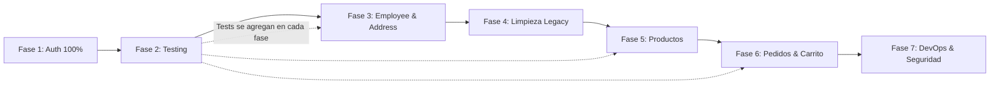

# 🗺️ Plan de Implementación — BurgerGo Backend

**Fecha:** 7 de Marzo, 2026  
**Estado actual:** Migración a Clean Architecture ~20% completada  
**Duración estimada total:** 12–16 semanas

---

## Visión General

```
Fase 1 ──► Fase 2 ──► Fase 3 ──► Fase 4 ──► Fase 5 ──► Fase 6 ──► Fase 7
Auth 100%  Testing   Employee   Address   Products    Pedidos    DevOps
                     & Address  & Limpieza& Categorías & Carrito  & Seguridad
2 semanas  1 semana  2 semanas  1 semana  3 semanas   3 semanas  2 semanas
```

---

## Fase 1: Completar Módulo Auth al 100%

**Duración:** ~2 semanas  
**Prioridad:** 🔴 Alta  
**Objetivo:** Migrar las 4 funcionalidades auth pendientes a Clean Architecture

### 1.1 — GetProfile Use Case (1 día)

| Capa | Archivo | Acción |
|------|---------|--------|
| Application | `application/use-cases/get-profile.use-case.ts` | **[NUEVO]** — Recibe `userId`, retorna usuario con relaciones |
| Presentation | `presentation/http/controller/auth.controller.ts` | **[MODIFICAR]** — Agregar método `getProfile` |
| Presentation | `presentation/http/routes/auth.routes.ts` | **[MODIFICAR]** — Agregar `GET /profile` con `verifyToken` |
| Presentation | `presentation/http/composition/auth.composition.ts` | **[MODIFICAR]** — Registrar `GetProfileUseCase` |

**Detalle:**
```typescript
// get-profile.use-case.ts
class GetProfileUseCase {
  constructor(private userRepo: IUserRepository) {}
  async execute(userId: string): Promise<UserEntity> {
    // Buscar usuario con relaciones (customer, rol)
    // Lanzar error si no existe
    // Retornar entidad de dominio
  }
}
```

---

### 1.2 — UpdateCustomerProfile Use Case (2–3 días)

| Capa | Archivo | Acción |
|------|---------|--------|
| Application | `application/use-cases/update-customer-profile.use-case.ts` | **[NUEVO]** |
| Application | `application/dtos/customer-user/request/update-customer-user.dto.ts` | **[VERIFICAR]** — Ya existe, validar campos |
| Domain | `domain/repository/customer.repository.interface.ts` | **[MODIFICAR]** — Agregar método `update()` si falta |
| Infrastructure | `infrastructure/repositories/customer.repository.ts` | **[MODIFICAR]** — Implementar `update()` |
| Presentation | Controller, Routes, Composition | **[MODIFICAR]** — Agregar endpoint `PUT /update-customer-profile` |

**Consideraciones:**
- Actualización parcial (solo campos enviados)
- Validar unicidad de DNI si se cambia
- Retornar perfil actualizado

---

### 1.3 — Refresh Token (2–3 días)

| Capa | Archivo | Acción |
|------|---------|--------|
| Domain | `domain/services/token.service.interface.ts` | **[MODIFICAR]** — Agregar `generateRefreshToken()`, `verifyRefreshToken()` |
| Infrastructure | `infrastructure/services/jwt-token.service.ts` | **[MODIFICAR]** — Implementar refresh token con secret separado |
| Application | `application/use-cases/refresh-token.use-case.ts` | **[NUEVO]** — Validar refresh, generar nuevo access token |
| Presentation | Controller, Routes, Composition | **[MODIFICAR]** — Agregar `POST /auth/refresh-token` |

**Flujo:**
```
Cliente envía refresh token (httpOnly cookie o header)
  → Backend valida refresh token
  → Genera nuevo access token (15 min)
  → Retorna nuevo access token
```

**Variables de entorno requeridas:**
```env
REFRESH_TOKEN_SECRET=<secret_diferente_al_access>
REFRESH_TOKEN_EXPIRY=7d
```

---

### 1.4 — Logout (1 día)

| Capa | Archivo | Acción |
|------|---------|--------|
| Presentation | Controller, Routes | **[MODIFICAR]** — Agregar `POST /auth/logout` |

**Implementación:**
- Limpiar cookie de refresh token (si se usa httpOnly cookie)
- En cliente: eliminar access token del estado

---

### 1.5 — Migrar endpoints pendientes al Controller Clean

Verificar que **todos** los endpoints del módulo auth legacy (`src/modules/auth/`) estén cubiertos en `src/presentation/http/controller/auth.controller.ts`. Una vez confirmado:

- [ ] Eliminar `src/modules/auth/` (legacy)
- [ ] Actualizar `src/routes.ts` para remover referencia a rutas auth legacy

---

## Fase 2: Configurar Testing

**Duración:** ~1 semana  
**Prioridad:** 🔴 Alta  
**Objetivo:** Establecer infraestructura de testing y cubrir módulo auth

### 2.1 — Setup de Jest + Supertest

```bash
npm install --save-dev jest ts-jest @types/jest supertest @types/supertest
```

| Archivo | Acción |
|---------|--------|
| `jest.config.ts` | **[NUEVO]** — Configuración de Jest con ts-jest |
| `package.json` | **[MODIFICAR]** — Agregar script `"test": "jest"`, `"test:watch": "jest --watch"` |
| `tsconfig.json` | **[VERIFICAR]** — Asegurar compatibilidad con Jest |

### 2.2 — Tests Unitarios del Módulo Auth

| Archivo de Test | Cubre |
|-----------------|-------|
| `__tests__/application/use-cases/login.use-case.spec.ts` | Login con email, username, credenciales inválidas |
| `__tests__/application/use-cases/register-customer.use-case.spec.ts` | Registro exitoso, email duplicado, validaciones |
| `__tests__/application/use-cases/verify-email-account.use-case.spec.ts` | Código válido, expirado, inválido |
| `__tests__/application/use-cases/change-password.use-case.spec.ts` | Password actual correcto/incorrecto |
| `__tests__/application/use-cases/resend-code.use-case.spec.ts` | Reenvío exitoso, cooldown activo |
| `__tests__/application/use-cases/get-profile.use-case.spec.ts` | Perfil existente, usuario no encontrado |

**Patrón de test:**
```typescript
describe('LoginUseCase', () => {
  let useCase: LoginUseCase;
  let mockUserRepo: jest.Mocked<IUserRepository>;
  let mockPasswordHasher: jest.Mocked<IPasswordHasher>;
  let mockTokenService: jest.Mocked<ITokenService>;

  beforeEach(() => {
    // Crear mocks de las interfaces
    // Instanciar use case con mocks (DI manual)
  });

  it('should return user and token on valid login', async () => { ... });
  it('should throw if user not found', async () => { ... });
  it('should throw if email not verified', async () => { ... });
  it('should throw if password is incorrect', async () => { ... });
});
```

### 2.3 — Tests E2E (Endpoints)

| Archivo de Test | Endpoints |
|-----------------|-----------|
| `__tests__/e2e/auth.e2e.spec.ts` | POST /auth/register, POST /auth/login, GET /auth/profile |

**Meta:** Cobertura mínima del **80%** en módulo auth.

---

## Fase 3: Migrar Módulos Employee y Address

**Duración:** ~2 semanas  
**Prioridad:** 🟡 Media

### 3.1 — Módulo Employee (1 semana)

Para cada capa, seguir el patrón ya establecido en Auth:

| Capa | Archivos a crear |
|------|------------------|
| **Domain** | `domain/entities/employee.entity.ts` (pura, sin TypeORM) |
| | `domain/repository/employee.repository.interface.ts` |
| **Application** | `application/use-cases/create-employee.use-case.ts` |
| | `application/use-cases/list-employees.use-case.ts` |
| | `application/use-cases/get-employee.use-case.ts` |
| | `application/use-cases/update-employee.use-case.ts` |
| | `application/use-cases/delete-employee.use-case.ts` |
| | `application/dtos/employee/` (request/response DTOs) |
| **Infrastructure** | `infrastructure/repositories/employee.repository.ts` |
| **Presentation** | `presentation/http/controller/employee.controller.ts` |
| | `presentation/http/routes/employee.routes.ts` |
| | `presentation/http/composition/employee.composition.ts` |

> **⚠️ IMPORTANTE**: Agregar middleware de autorización (solo admin puede gestionar empleados).

### 3.2 — Módulo Address (1 semana)

| Capa | Archivos a crear |
|------|------------------|
| **Domain** | `domain/entities/address.entity.ts` |
| | `domain/repository/address.repository.interface.ts` |
| **Application** | `application/use-cases/create-address.use-case.ts` |
| | `application/use-cases/list-addresses.use-case.ts` |
| | `application/use-cases/update-address.use-case.ts` |
| | `application/use-cases/delete-address.use-case.ts` |
| | `application/dtos/address/` (request/response DTOs) |
| **Infrastructure** | `infrastructure/repositories/address.repository.ts` |
| **Presentation** | `presentation/http/controller/address.controller.ts` |
| | `presentation/http/routes/address.routes.ts` |
| | `presentation/http/composition/address.composition.ts` |

**Validaciones de negocio:**
- No eliminar la última dirección
- Máximo de direcciones por cliente (ej: 5)
- Una dirección predeterminada obligatoria

### 3.3 — Tests de Employee y Address

- Tests unitarios para cada use case
- Tests E2E para los endpoints

---

## Fase 4: Eliminar Código Legacy

**Duración:** ~1 semana  
**Prioridad:** 🟡 Media  
**Objetivo:** Remover toda la arquitectura legacy una vez migrada

### Archivos y carpetas a eliminar:

```
❌ src/controllers/              → Reemplazados por presentation/http/controller/
❌ src/services/                 → Reemplazados por application/use-cases/
❌ src/routes/                   → Reemplazados por presentation/http/routes/
❌ src/modules/auth/             → Ya migrado a Clean Architecture
❌ src/modules/employee/         → Migrado en Fase 3
❌ src/dtos/                     → Consolidados en application/dtos/
❌ src/entities/                 → Reemplazados por infrastructure/database/typeorm/entities/
❌ src/errors/                   → Reemplazados por domain/errors/
❌ src/interfaces/               → Reemplazados por domain/
❌ src/middlewares/               → Reemplazados por presentation/http/middlewares/
❌ src/middleware/                → Duplicado, eliminar
❌ src/routes.ts                 → Ya no necesario
❌ src/server.ts                 → Reemplazado por serverV2.ts
```

### Pasos:

1. Verificar que **ningún import** en el código nuevo apunte a carpetas legacy
2. Actualizar `src/index.ts` si tiene referencias legacy
3. Eliminar archivos legacy
4. Ejecutar `npm run build` para verificar que no hay errores
5. Ejecutar tests
6. Renombrar `serverV2.ts` → `server.ts`

---

## Fase 5: Implementar Productos y Categorías

**Duración:** ~3 semanas  
**Prioridad:** 🔴 Alta (core del negocio)

### 5.1 — Módulo Categories (3–4 días)

| Capa | Archivos |
|------|----------|
| Domain | `domain/entities/category.entity.ts`, `domain/repository/category.repository.interface.ts` |
| Application | `CreateCategoryUseCase`, `ListCategoriesUseCase`, `UpdateCategoryUseCase`, `DeleteCategoryUseCase` |
| Infrastructure | `infrastructure/repositories/category.repository.ts` |
| Presentation | Controller, Routes, Composition |

**Campos de Category:**
- `id` (UUID)
- `name` (string, único)
- `description` (string)
- `image_url` (string, opcional)
- `is_active` (boolean)
- `order` (number, para ordenamiento visual)

### 5.2 — Módulo Products (1.5 semanas)

**Campos de Product:**
- `id` (UUID)
- `name` (string)
- `description` (string)
- `price` (decimal)
- `discount_price` (decimal, opcional)
- `image_url` (string)
- `is_available` (boolean)
- `stock` (number)
- `category_id` (FK)
- `preparation_time` (number, minutos estimados)

**Use Cases:**
| Use Case | Endpoint | Acceso |
|----------|----------|--------|
| `CreateProductUseCase` | `POST /api/products` | Admin |
| `ListProductsUseCase` | `GET /api/products` | Público |
| `GetProductUseCase` | `GET /api/products/:id` | Público |
| `UpdateProductUseCase` | `PUT /api/products/:id` | Admin |
| `DeleteProductUseCase` | `DELETE /api/products/:id` | Admin |
| `SearchProductsUseCase` | `GET /api/products/search?q=` | Público |
| `UploadProductImageUseCase` | `POST /api/products/:id/image` | Admin |

### 5.3 — Servicio de Cloudinary

| Archivo | Acción |
|---------|--------|
| `domain/services/image-storage.interface.ts` | **[NUEVO]** — Interface `IImageStorageService` |
| `infrastructure/services/cloudinary-image.service.ts` | **[NUEVO]** — Implementación con Cloudinary |

```typescript
interface IImageStorageService {
  upload(file: Buffer, folder: string): Promise<{ url: string; publicId: string }>;
  delete(publicId: string): Promise<void>;
}
```

### 5.4 — Paginación Genérica

Crear utilidad reutilizable:

```typescript
// application/dtos/common/pagination.dto.ts
interface PaginationRequest {
  page?: number;    // default: 1
  limit?: number;   // default: 20
  sortBy?: string;
  sortOrder?: 'ASC' | 'DESC';
}

interface PaginatedResponse<T> {
  data: T[];
  meta: {
    total: number;
    page: number;
    limit: number;
    totalPages: number;
    hasNext: boolean;
    hasPrev: boolean;
  };
}
```

---

## Fase 6: Sistema de Pedidos y Carrito

**Duración:** ~3 semanas  
**Prioridad:** 🔴 Alta (funcionalidad core)

### 6.1 — Entidades de Dominio

```
OrderEntity
├── id (UUID)
├── customer_id (FK)
├── address_id (FK)
├── status (enum: pendiente|confirmado|en_preparacion|en_camino|entregado|cancelado)
├── subtotal (decimal)
├── delivery_fee (decimal)
├── discount (decimal)
├── total (decimal)
├── notes (string, opcional)
├── estimated_delivery (timestamp)
├── created_at
└── updated_at

OrderItemEntity
├── id (UUID)
├── order_id (FK)
├── product_id (FK)
├── quantity (number)
├── unit_price (decimal)
├── subtotal (decimal)
└── notes (string, personalización)

CartEntity
├── id (UUID)
├── customer_id (FK, único)
└── created_at

CartItemEntity
├── id (UUID)
├── cart_id (FK)
├── product_id (FK)
├── quantity (number)
└── notes (string)
```

### 6.2 — Use Cases del Carrito

| Use Case | Endpoint |
|----------|----------|
| `AddToCartUseCase` | `POST /api/cart/items` |
| `UpdateCartItemUseCase` | `PUT /api/cart/items/:id` |
| `RemoveCartItemUseCase` | `DELETE /api/cart/items/:id` |
| `GetCartUseCase` | `GET /api/cart` |
| `ClearCartUseCase` | `DELETE /api/cart` |

### 6.3 — Use Cases de Pedidos

| Use Case | Endpoint |
|----------|----------|
| `CreateOrderUseCase` | `POST /api/orders` (convierte carrito → pedido) |
| `GetOrderUseCase` | `GET /api/orders/:id` |
| `ListCustomerOrdersUseCase` | `GET /api/orders` |
| `CancelOrderUseCase` | `PATCH /api/orders/:id/cancel` |
| `UpdateOrderStatusUseCase` | `PATCH /api/orders/:id/status` (empleado/admin) |
| `ListAllOrdersUseCase` | `GET /api/admin/orders` (admin) |

**Reglas de negocio importantes:**
- Usar transacciones al crear pedidos (reservar stock)
- Máquina de estados para transiciones válidas del pedido
- Ventana de cancelación: 5 minutos
- Email de confirmación al crear pedido

---

## Fase 7: Seguridad, DevOps y Optimizaciones

**Duración:** ~2 semanas  
**Prioridad:** 🟢 Media-Baja

### 7.1 — Seguridad

| Paquete | Propósito |
|---------|-----------|
| `helmet` | Headers de seguridad HTTP |
| `express-rate-limit` | Rate limiting global |
| `hpp` | Protección HTTP Parameter Pollution |

```bash
npm install helmet express-rate-limit hpp
```

**Implementaciones:**
- Rate limiting: 100 req/15min general, 5 req/15min en login
- Helmet con CSP personalizado
- Sanitización de inputs en todos los endpoints

### 7.2 — Documentación API

```bash
npm install swagger-jsdoc swagger-ui-express @types/swagger-jsdoc @types/swagger-ui-express
```

- Documentar todos los endpoints con decoradores JSDoc
- Disponible en `GET /api-docs`

### 7.3 — Migraciones de Base de Datos

- Desactivar `synchronize: true`
- Configurar TypeORM CLI para migraciones
- Crear migración inicial con el schema actual
- Agregar scripts en `package.json`:
  ```json
  "migration:generate": "typeorm migration:generate",
  "migration:run": "typeorm migration:run",
  "migration:revert": "typeorm migration:revert"
  ```

### 7.4 — CI/CD (GitHub Actions)

```yaml
# .github/workflows/ci.yml
on: [push, pull_request]
jobs:
  test:
    - npm ci
    - npm run lint
    - npm run type-check
    - npm run test
  build:
    - npm run build
```

### 7.5 — Monitoreo y Logging

- Evaluar implementación de Redis para caché y sesiones
- Considerar Bull/BullMQ para colas de emails
- Health check endpoint: `GET /api/health`

---

## Cronograma Visual

```
Semana   1    2    3    4    5    6    7    8    9   10   11   12   13   14
       ├────┼────┼────┼────┼────┼────┼────┼────┼────┼────┼────┼────┼────┤
Fase 1 ████████                                              Auth 100%
Fase 2           ████                                         Testing
Fase 3                ████████                                Employee+Address
Fase 4                          ████                          Limpieza Legacy
Fase 5                               ████████████             Productos+Categorías
Fase 6                                              ████████████  Pedidos+Carrito
Fase 7                                                        ████████  DevOps
```

---

## Métricas de Éxito

| Métrica | Valor Objetivo |
|---------|---------------|
| Cobertura de tests | ≥ 80% |
| Código legacy eliminado | 100% |
| Módulos migrados a Clean Architecture | 100% (7/7) |
| Endpoints documentados (Swagger) | 100% |
| Tiempo de respuesta promedio | < 200ms |
| Uptime | ≥ 99.5% |

---

## Dependencias entre Fases



> **Nota:** Aunque Testing es una fase propia (Fase 2), los tests deben escribirse **durante** cada fase posterior, no solo al principio.

---

**Autor:** Generado automáticamente  
**Última actualización:** 7 de Marzo, 2026
